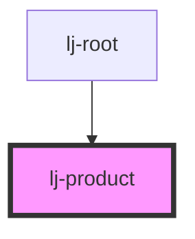

# lj-product

<!-- Auto Generated Below -->

## Properties

| Property      | Attribute     | Description | Type                      | Default     |
| ------------- | ------------- | ----------- | ------------------------- | ----------- |
| `changeCart`  | --            |             | `(price: number) => void` | `undefined` |
| `description` | `description` |             | `string`                  | `undefined` |
| `image`       | `image`       |             | `string`                  | `undefined` |
| `name`        | `name`        |             | `string`                  | `undefined` |
| `price`       | `price`       |             | `number`                  | `undefined` |

## Dependencies

### Used by

 - [lj-root](../lj-root)

### Graph

----------------------------------------------

*Built with [StencilJS](https://stenciljs.com/)*
